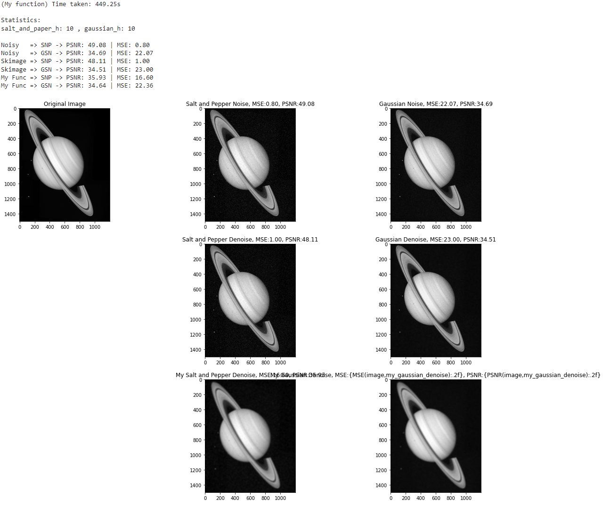

# Image denoising using the non local means algorithm

Image denoising plays an important role in a wide range of applications such as image restoration, visual tracking, image registration, image segmentation, and image classification, where obtaining the original image content is crucial for strong performance. While many algorithms have been proposed for the purpose of image denoising, the problem of image noise suppression remains an open challenge, especially in situations where the images are acquired under poor conditions where the noise level is very high.

I implemented the non-local means filter as described in this publication: A. Buades, B. Coll and J. -. Morel, "A non-local algorithm for image denoising," 2005 IEEE Computer Society Conference on Computer Vision and Pattern Recognition (CVPR'05), 2005, pp. 60-65 vol. 2, doi: 10.1109/CVPR.2005.38.

The algorithm was tested on 10 sample images and also compared with Gaussian filtering. I have added a report with the observations and findings.

### Sample output screenshot

